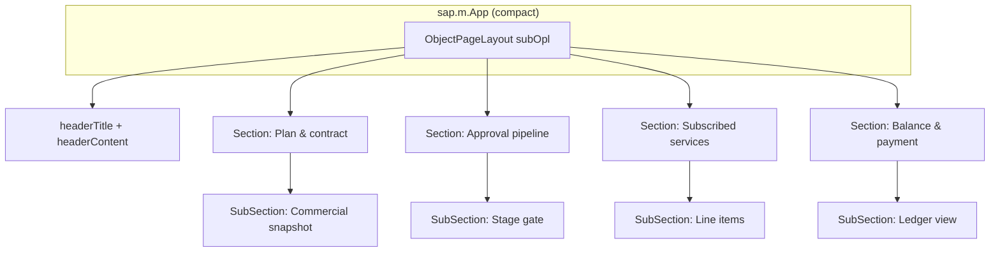
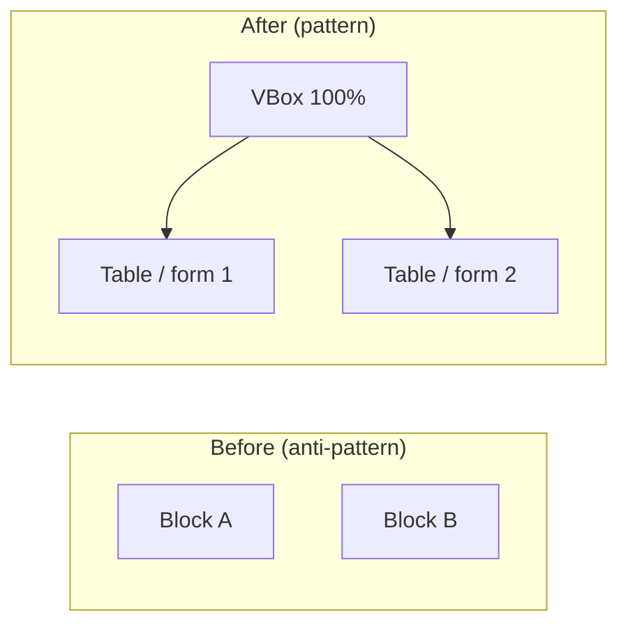
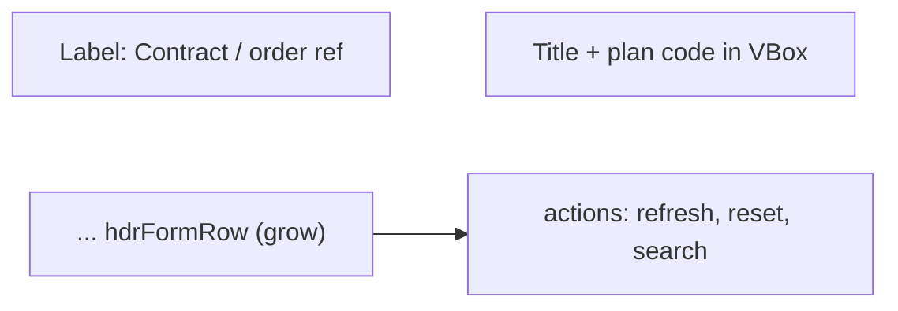
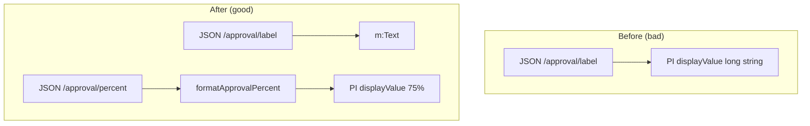
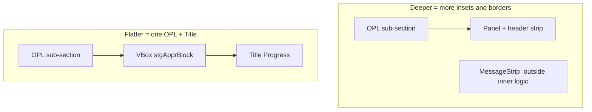
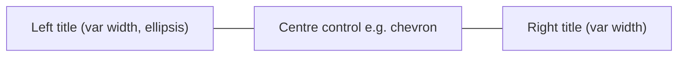
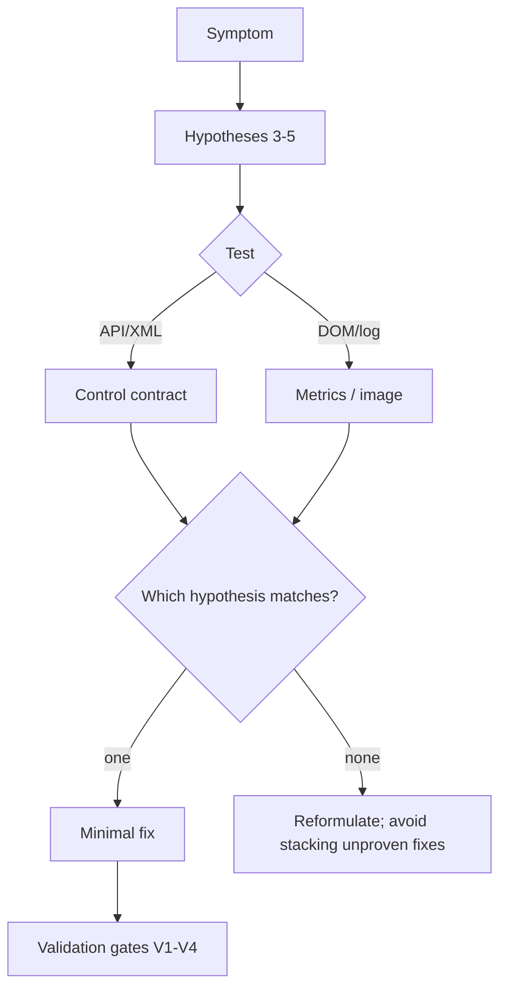
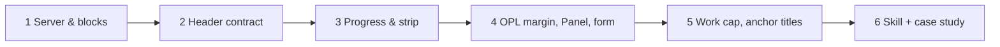

# Case study: Rebuilding a SAP Fiori–style object page (compact) for a B2B subscription & billing demo

**Subtitle:** From crushed tables, header wrap, and “fake padding” to a coherent `sap.uxap` + `sap.m` layout — hypotheses, LLM pair-programming, and evidence-led fixes.

**Context:** A static OpenUI5 demo in **sap-ai-design-system-c** (`examples/subscription-billing/webapp/`) served on port **8088** (`make demo-subscription`), theme **sap_horizon**, density **Compact**.

**Audience:** UI5 developers, solution architects, and teams using LLM assistance for Fiori-like demos.

**Length:** This document is structured for **export to PDF** (≈10–12 pages with diagrams) or reading in a viewer that renders Mermaid (GitHub, many IDEs, Typora, mdBook).

---

## 1) Executive summary

A B2B subscription and billing **cockpit** was implemented as a single `sap.uxap.ObjectPageLayout` with **sections** and **sub-sections** for Key figures (form), approval pipeline (message strip, progress, table), line items, and working capital (balance). The work surfaced **repeated** layout failure modes that are easy to blame on “theme” or “padding” but in practice came from: **(a)** `ObjectPageSubSection` **`blocks` placement** (side-by-side blocks), **(b)** `HBox` **wrap** and **nested** `sap.m.Panel` chrome, **(c)** `sap.m.ProgressIndicator` **value** row in **`sapUiSizeCompact`**, and **(d)** `sapUiResponsiveMargin` on top of OPL insets (double indents).

The response followed **source of truth** (UI5 API), **hypotheses** with **DOM** or **NDJSON** checks where useful, and **small** diffs. **Outcomes** included: one `VBox` per `blocks` aggregation; a **no-wrap** header **contract** row with **FlexItemData**; long approval copy on **`m:Text`**, **percent** only in `displayValue` (formatter `formatApprovalPercent`); **removal of nested** `Panel` in favour of `VBox` + `m:Title` where a single OPL “card” was enough; **paired, shorter** subsection `title` attributes for a fairer **anchor** strip; and a **Cursor skill** capturing **process** and **patterns** for reuse.

**Bottom line:** Most “padding” and “overlap” issues were **structural** (aggregations, flex, and double containers), not a missing one-line CSS tweak.

---

## 2) Business and technical context

**Business framing (demo):** A **company** **cockpit** for **active** **subscription** **billing**: **plan** and **contract** summary in the **header**, **stage** **gate** for **order** / **compliance** **mocks**, **subscribed** **line** **items**, and **ledger**-style **balances**. **Unsubscribe** / **Re-subscribe** / **Reset** **mutate** a **client-side** `JSONModel` (no real backend).  

**Technical stack:**

| Layer | Choice |
|--------|--------|
| **Shell** | `sap.m.App` with `sapUiSizeCompact` |
| **Page** | `sap.uxap.ObjectPageLayout` (`id="subOpl"`) — anchor bar, sections, not icon tab bar for this build |
| **Content** | `sap.m` (VBox, HBox, Panel *removed later*, Table, MessageStrip, ProgressIndicator, …) |
| **Forms** | `sap.ui.layout.form.SimpleForm` + **ResponsiveGridLayout** |
| **Load** | `https://ui5.sap.com/.../sap-ui-core.js` (CDN), **resource root** `subbilling` → `./` |

*Illustration — high-level component tree (simplified):*



---

## 3) The journey: from first symptoms to a stable layout

**Phase A — “Nothing runs” and “it looks broken in the first minute”**

| Symptom | What users said / saw | True cause |
|---------|------------------------|------------|
| **ERR_CONNECTION_REFUSED** on 8088 | “App won’t open” | **No** `http.server` / **no** `make demo-subscription` |
| **Tables squeezed or empty** | “Middle column empty, tables narrow” | **Two** (or more) **top-level** **`blocks`** in one **`ObjectPageSubSection`**, laid out in **columns** by UxAP |

*Illustration — wrong vs right `blocks` pattern:*



**Fix:** A **single** `sap.m.VBox` `width="100%"` `alignItems="Stretch"` as the **only** `blocks` child, with all former blocks’ content as **siblings** inside. **`useIconTabBar="false"`** where icon tabs are not part of the design.

**Phase B — Header: contract / order ref. and actions (refresh, reset, search)**

| Symptom | Initial mis-read | Confirmed cause (runtime) |
|--------|------------------|---------------------------|
| “Left and right on two lines” | Maybe overflow toolbar height | **Flex** `wrap` and **row** break — **both** **groups** could share **`left`** in **`getBoundingClientRect()`** but different **`top`** (stacked) |
| “Label and value not in one row” | CSS margin | **Layout** of **label** and **value** in a **tight** **row** without **Fiori**-style **form** **row** |

**Hypotheses tested:** (H1) **wrapping** `HBox` — **CONFIRMED**; (H2) **separate** **label** and **value** in **one** **horizontal** **group** with **`textAlign="End"`** on **label** — **CONFIRMED**; (H3) **needs** `OverflowToolbar` for contract row — **REJECTED** (toolbar can **clip** **multi**-line; **plain** `HBox` **wins** for this **demo**).

**Fix pattern:** `hdrOuterHBox` with **`wrap="false"`** and **`justifyContent="SpaceBetween"`**; **inner** contract **`HBox` `hdrFormRow`** with **`layoutData` → `sap.m.FlexItemData` grow 1, shrink;** **actions** `hdrActionsHBox` with **grow 0**; **SearchField** **not** full viewport width (e.g. `12rem`).

*Illustration — header flow (logical):*



**Phase C — “Padding is weird” on the progress block**

| What it looked like | What it was *not* | What it was |
|---------------------|------------------|------------|
| Long sentence **kissing** the **dark** **bar** | Random MessageStrip margin | **`ProgressIndicator`**: long **`displayValue`** lives on the **value** **row** **above** the **track**; **Compact** **density** = **tight** **row** |

**Hypotheses:** (H-PI-1) **MessageStrip** `type` — **partly**; using **`type="Information"`** improves the **info** **strip** **chrome**; (H-PI-2) **long** `displayValue` **collides** with **bar** — **CONFIRMED** by **metric** `gapTextToBar` = **`barTop - textBottom`**. After split: **positive** (e.g. **23** px) in one verification run.

**Fix:** `m:Text` `id="stgApprSubtext"` for **`{/approval/label}`**; `ProgressIndicator` `displayValue` = **`formatApprovalPercent`** on **`{/approval/percent}`** only (controller **formatter**).

*Illustration — data path before vs after:*



**Phase D — “Content to the right of the title, double edge on the right, form only on the left”**

| Layer | Error | Effect |
|-------|--------|--------|
| **Margin** | `sapUiResponsiveMargin` on **OPL** **block** child | **Double** **indent** vs. **sub-section** **title** **column** |
| **Chrome** | **`m:Panel`** **inside** **`blocks`** | OPL “card” + **Panel** **border/background** = **stair** **step** on the **right** |
| **Form** | RGL: `columnsXL="2"`, `emptySpan*`, `singleContainerFullSize="false"` | Narrow form in one column of the grid; large empty right area |

**Fix:** **Remove** **responsive** **margin** on **block** **wrapper**; **replace** **nested** **`Panel`** with **`VBox` + `m:Title`** (Key figures, **Stage** **gate** **group**, **Working** **capital**); **one** **column** **XL** **form**, **`emptySpan` 0**, **`singleContainerFullSize="true"`**, **`width="100%"`** where the API allows.

**Stage-gate cohesion:** Keep `MessageStrip`, approval text + `ProgressIndicator`, and the stages `Table` in the *same* parent `VBox` (`stgApprBlock`) so they share one horizontal inset. Previously, strip and table could sit in different padding contexts when `MessageStrip` was outside a `Panel` and the table was inside it — that was resolved by removing the inner `Panel` and using a single `VBox` stack.

*Illustration — nesting depth:*



**Phase E — Sticky sub-section bar: “space between the chevron and the titles looks wrong”**

| Fact | Implication |
|------|------------|
| UxAP **does** **not** **optically** **centre** a **centre** **control** between **left** and **right** **labels** the way a human **estimates** “equal whitespace” to **glyphs** | **Tuning** **string** **lengths** and **avoiding** **lopsided** **truncation** (ellipsis) is **the** **first** **lever** |
| Asymmetric visible text (left title truncated, e.g. to “…ems (company view)”, right title still long) | Pair shorter `ObjectPageSubSection` titles, e.g. *Line items (company view)* and *Ledger view (illustrative)* |

*Illustration — not optical centre, but row mechanical layout:*



**Custom CSS** on internal `sap.uxap` **classes** is a **last** **resort** (theme **breaks** on **upgrade**). **Scoping** and **evidence** from **DevTools** **only**.

---

## 4) How we worked: prompts, process, and evidence

**Representative** **user** / **stakeholder** **prompts** (paraphrased) over the **session arc:**

1. *Run the B2B subscription demo; align it with the rest of the registry / docs.*  
2. *ERR_CONNECTION_REFUSED on 8088 — what’s wrong?*  
3. *Tables/sections are squeezed or empty; fix the layout.*  
4. *The contract row is wrong; left/right don’t line up; debug the header.* (→ geometry logs)  
5. *Padding on the progress area is bad; fix the real cause.*  
6. *Overlapping on the right, content shifted, not centered — fix the body layout.*  
7. *Working capital “pill” header looks wrong — fix it the same way.*  
8. *Is the space between the sub-section titles and the chevron correct?*  
9. *Save everything in a skill: validations, source of truth, first steps, planning, guidelines.*  
10. *Write a case study with illustrations.*

**Method** (repeatable for other UI5 + LLM sessions):

1. **Source of truth** first: **OpenUI5** **API** for the **control** in the **suspect** path, then **repo** **XML** **view**, then **runtime** (never **solely** model **guess**).  
2. **3–5** **hypotheses**; **falsify** with **one** of: **API** **read**, **XML** **inspection**, **rect** **metrics**, **screenshot**.  
3. **One** **minimal** **fix** per **verified** **cause**; **revert** code if the **hypothesis** **fails** (no **pile**-**on** of **defensive** **hacks**).  
4. **Debug** **ingest** (optional): **one** `onAfterRendering` **+** `fetch` **per** **load**; **`delete_file`** on **the** **session** log **before** a **re**-**run**; **strip** from **shipped** **code** when **done**.  
5. **Ship** with **V1**–**V4** in the **playbook** (no **ingest** in **controller**, **browser** pass, **demo** **actions**, **linter**).

*Illustration — evidence loop:*



*Illustration — session **phase** order (not to scale in time):*



```text
+------------------------------------------------------------------+
|  ASCII: “Double chrome”  (OPL sub-section)                       |
+------------------------------------------------------------------+
|  +---------------- OPL / block chrome ----------------+           |
|  |  +-- Panel (border, header bar) --+  <- remove for demo     |  |
|  |  |  (nested card look)            |     when one card     |  |
|  +--+-------------------------------+-- enough              |  |
+------------------------------------------------------------------+
|  After: OPL + VBox + Title + content  (one visual frame)         |
+------------------------------------------------------------------+
```

---

## 5) Outcomes: what “good” looks like (observable)

| Area | “Good” signal |
|------|----------------|
| **Blocks** | One visible column of content per sub-section (no half-empty OPL “row” of two blocks). |
| **Header** | Contract and actions on one row at typical desktop width; label and value in a Fiori-style row. |
| **Progress** | No long prose in `displayValue` on `ProgressIndicator`; if measured, `gapTextToBar` ≥ 0 after split (example: 23px). |
| **Body** | No second “card” from unnecessary `Panel`; `SimpleForm` full width; `MessageStrip` and `Table` share the same `VBox` inset where intended. |
| **Sub-section bar** | Shorter, paired `title` strings; UxAP bar is *not* optical center of label text. |
| **Repository** | No `fetch` to debug ingest in shipped controller; `formatApprovalPercent` and view structure remain the durable code. |

---

## 6) What we would do differently (or the same) next time

| Do **again** | Change **or** add |
|-------------|-----------------|
| **Start** with **OPL** `blocks` **count** and **RGL** **column** / **span** | **Add** a **one**-**page** **wireframe** in **Figma** or **Miro** for **OPL** **section** / **sub-section** / **block** before **filling** **content** (even for **demos**). |
| **Measure** for **sceptical** **“padding”** **bugs** (PI, flex) | **Add** a **permanent** **QUnit** or **Cypress** **smoke** only if the **org** **demands** **it**; **static** **demo** may **rely** on **checklist** **V2**. |
| **Document** a **playbook** **skill** | **Version** the **skill** in **the** **repo** **`.cursor/skills/`** for **team** **shares** (the **user**-**local** path is `~/.cursor/skills/...` **for** the **author**). |

---

## 7) Conclusion

This case study narrates a single B2B subscription **demo** built on `sap.uxap.ObjectPageLayout`. Failures were mostly **structural** and **control-contract** issues: *which* control sits in `blocks`, how `ProgressIndicator` and `SimpleForm` behave in **Compact**, and how **nested** `Panel` and **margin** **classes** stack. Many user-visible “padding” issues disappeared once **data** and **markup** were moved to the **right** **aggregations** and **nesting** and **redundant** **margins** were reduced.

The **Cursor** skill `sapui5-opl-subscription-demo` in the same package directory keeps **procedures** (source of truth, first steps, planning, validation, guidelines) and **tactical** **XML/controller** **patterns** together for **reuse**.

---

## 8) Appendix: artefact and file index

| Artifact | Path (under skill package) |
|----------|----------------------------|
| **Main** **playbook** | `.../SKILL.md` |
| **Source of truth** | `.../references/source-of-truth.md` |
| **Planning & validation** | `.../references/planning-and-validation.md` |
| **Guideline checklist** | `.../references/guidelines-checklist.md` |
| **Quick reference tree** | `.../references/quick-reference.md` |
| **Short** **worked** **examples** | `.../references/examples.md` |
| **This** **case** **study** | `.../case-study/Case-Study-UXAP-Subscription-Layout-Repair.md` |

**Repository** (application **code**; branch **may** **vary**): `examples/subscription-billing/webapp/` in **sap-ai-design-system-c** (GitHub: `Venelinhr/sap-ai-design-system-c`).

---

## 9) Appendix: Glossary of session terms (quick)

| Term | Meaning in this work |
|------|----------------------|
| **OPL** | `sap.uxap.ObjectPageLayout` |
| **RGL** | `ResponsiveGridLayout` on `SimpleForm` |
| **Compact** | `sapUiSizeCompact` class family |
| **Ingest** | **Debug** **NDJSON** **POST** to a local **ingest** **URL** in **dev**; **not** in **shipped** **code** |
| **UxAP** | **UX** **API** / **Fiori** **object** **page** **library** `sap.uxap` |
| **Double** **chrome** | **OPL** **sub-section** **block** + **inner** `Panel` **frame** = **stacked** **borders/backgrounds** |

---

*End of case study. For **Mermaid** **rendering** in **print**, use a **PDF** **exporter** that **executes** **Mermaid** (e.g. **Pandoc** with **a** **mermaid** **filter**, **md-to-pdf** **with** **Mermaid** **support**, or **VS** **Code** / **Cursor** **markdown** **PDF** **extensions** that **render** **diagrams**). If **Mermaid** **fails** in **print**, the **text** and **table** **section**s **stand** **alone**.*
