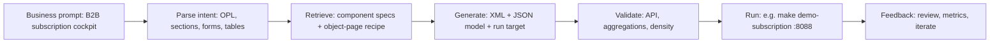

# Partner brief: Making SAP Fiori / UI5 **machine-readable** for LLM agents — from prompt to application

**Audience:** Business partners, product owners, enterprise architects  
**Companion:** The **sap-ai-design-system-c** repository (LLM-oriented SAPUI5 metadata, patterns, demos) and the **subscription-billing** Object Page work documented in this skill package.  
**Purpose:** Explain why **today’s** design handoff is poor for **AI-assisted** delivery, what a **readable** design system means for **agents**, and how **natural-language** intent can connect to **working** Fiori-style UIs with **governance** and **speed**.

---

## 1) The issue (stakeholder view)

**What we want:** Use **large language models** to **accelerate** SAP Fiori–style screens (Object Page, forms, tables, approval paths) without abandoning the **Fiori** look and **OpenUI5** **correctness**.

**What happens in practice without the right system:**  
Agents **invent** control names, **break** `sap.uxap` / `sap.m` **aggregations** (e.g. `blocks`, `SimpleForm` layout), and cannot map a vague *“like the design”* request to **valid** view XML. Every output needs **expert** rescue.

**Why this is a business problem**
- **Longer** delivery cycles and **higher** cost per screen.  
- **Compliance and trust:** off-pattern density, a11y, and information layout may drift.  
- **Non-auditable** “AI did it” when there is no **retrieved** **spec** and **no** **API** **trail**.

**One-line diagnosis:** *The design system you give to people (PDF, slides, Figma, prose) is not the same artifact a machine must use to emit correct software—unless you add a structured, verifiable layer (API + specs + patterns).*

---

## 2) Root cause: why the “classic” design system is not **modern-agent ready**

| Gap | What orgs often have | What an **LLM** needs |
|-----|------------------------|------------------------|
| **Source of truth** | Narrative in Confluence, PDF, decks | **Structured** JSON/YAML, **versioned** **schema**, **stable** **IDs** |
| **Component contract** | Pixels, component names in English | For each control: **module** (`sap.uxap.*`, `sap.m.*`), **aggregations**, **properties**, **defaults** (as in the **UI5 API**) |
| **Layout rules** | “Use object page for detail” in text | **Explicit** rules: e.g. one `blocks` child as a full-width `VBox` when you need a **stack**, not two side-by-side `blocks` |
| **Tokens** | Hex in Figma, disconnected from code | **Named** tokens and **mappings** to **control** properties / theme / density where generatable |
| **Quality** | Subjective “design QA” | **Checkable** constraints: allowed libs, compact vs cozy, no illegal child in an aggregation |
| **Traceability** | “Looks on-brand” | **Prompt** → **retrieved** spec lines → **generated** view — **reproducible** **path** for audit |

**Plain language:** Most enterprise design systems are **written for people who already know UI5**. They do **not** disambiguate **hundreds** of classes and **incompatible** **layout** **grammars** the way a **reliable** **generator** must.

---

## 3) What a **readable** design system (for LLM agents) must include

A **machine-readable** layer does **not** replace **Fiori** or **Horizon**; it **indexes** the **same** **official** building blocks and **Fiori** **patterns** into a **form** agents can **query**, **validate**, and **compose**.

1. **Technical single source of truth** — The **OpenUI5 / SAPUI5 API** for the **shipped** **version** (no “agent book” that **contradicts** the API).  
2. **Deterministic component spec** (e.g. JSON) — **Stable** id per control (`sap.uxap.ObjectPageLayout`, `form.SimpleForm`, …), **aggregations**, **child** **types**, **key** **properties** and **enums** for generation.  
3. **Pattern library as data** — B2B **Object Page**, worklist, create flow: each a **template** with **placeholders** and **do/don’t** (e.g. *do not* use two `blocks` when you need one full-width table).  
4. **Density and semantics** — e.g. `sapUiSizeCompact` vs cozier density; `MessageStrip` `type`. Encode rules so a “padding bug” is not fixed with ad hoc CSS when it is a control contract issue (e.g. `ProgressIndicator` with long `displayValue` in compact).  
5. **Retrieval, not infinite context** — Inject only relevant spec slices and one pattern recipe per user prompt.  
6. **Prompt-to-application pipeline** — Intent → spec retrieval → view/controller generation → local run (e.g. `make …`) → validation gates (the skill’s V1–V5 model).  
7. **Human where it matters** — Legal copy, brand nuance, one-off visual polish; agents for repetitive skeletons and wiring at scale.

---

## 4) The bridge: **prompt → application** (for slides)

**Value for partners**
- **Repeatability** — Same **archetype** of prompt maps to a **known** **recipe**, not a one-off chat answer.  
- **Auditability** — Show **which** spec lines and **API** **facts** **supported** each **line** of XML.  
- **Speed** — First **drafts** in **hours**; **Fiori** **experts** **tune** **gaps** only.

---

## 5) Relationship to **SAP** **Fiori** and **UI5** (clarify for the room)

- **Fiori** remains the **user-facing** design language.  
- **OpenUI5** is the **hard** **contract** (names, children, types).  
- The **innovation** is **orchestration**: **metadata** + **retrieval** + **recipes** + **gates** so *prompt-to-app* is **“compose by spec”**, not *guess a control that does not exist*.

---

## 6) **Proof** point: subscription-billing Object Page (this case study)

The static demo in `examples/subscription-billing` improved through **structural** rules that belong in a **machine-readable** pattern library, not only through “better” **chat**:
- Two `blocks` children in one `ObjectPageSubSection` → side-by-side layout and squeezed tables. **Rule:** one `VBox` with `width="100%"` inside `blocks`.  
- Nested `m:Panel` inside OPL plus `sapUiResponsiveMargin` → double insets and stair-step borders. **Rule:** in this demo, one visual “card”; use `m:Title` + content instead of a redundant `Panel` header.  
- Long text in `ProgressIndicator` `displayValue` in compact → apparent overlap / “padding” bug. **Rule:** long copy on `m:Text`, short `displayValue` (percent) + controller formatter; teachable as JSON pattern.  
- Sub-section anchor bar looks uneven → often ellipsis + unequal title lengths, not a broken theme. **Rule:** pair shorter subsection `title` strings; document in an AI-delivery FAQ.

**Takeaway for partners:** You converge faster to a Fiori-credible UI when the agent is grounded in API + recipes, not only a mood board.

---

## 7) Suggested **talking** **points** (copy as needed)

1. *“Design systems today are written for people. AI-assisted build needs a parallel layer: API-backed data, pattern recipes, and retrieval.”*  
2. *“We are not replacing SAP Fiori; we are making the same controls and layouts addressable in a form LLMs can verify against the OpenUI5 contract.”*  
3. *“Prompt-to-application is a defined pipeline, not a single magic prompt. The subscription demo is a concrete example of structure beating vibes.”*  
4. *“Invest in metadata and quality gates; treat unstructured PDFs as inspiration only for mechanical truth.”*

---

## 8) Where the artefacts live (for your deck or data room)

| Asset | Path (in this skill package) | For whom |
|-------|--------------------------------|----------|
| Engineering playbook | `SKILL.md` | Developers, AI agent authors |
| **This partner brief** | `case-study/Partner-Brief-Design-System-Readability-For-LLM-Agents.md` | **You** (this meeting) |
| Long UX **repair** story | `case-study/Case-Study-UXAP-Subscription-Layout-Repair.md` | “How we debugged a real OPL” |
| Checklists, SoT, planning | `references/*` | R&D, governance |

**Optional:** Copy the whole folder `sapui5-opl-subscription-demo` to `{repo}/.cursor/skills/` in git for versioned handoff to partners and vendors.

---

## 9) Suggested next steps (pick what fits)

- Sponsor a pilot with *N* screens from standard Fiori patterns, a **pinned** UI5 version in the retrieval index, and retrieval-augmented generation.  
- Publish a short “LLM-readable” addendum to your design system: link the OpenUI5 API as source of truth plus your org’s JSON component index.  
- Map design QA to objective gates: API violations, illegal aggregations, optional DOM metrics in dev—not only “it feels off.”  
- In every agent demo, ask: *Which retrieved spec lines and which UI5 API statements justify this line of view XML?*

---

*Version: aligned with the `sapui5-opl-subscription-demo` skill. Bump a version in the repo (or a header in this file) when your component registry schema or UI5 version pin changes.*
